# 基于FastAPI的Docpilot项目梳理

## 1. 分模块

项目可以粗略分为八大模块，分别为：

①用户认证 → ②文档 CRUD（含AI摘要）→ ③PDF入库 → ④智能问答(RAG+记忆) → 
⑤数据模型 → ⑥ 前端展示 → ⑦基础设施

## 2. 数据流转

### 2.1 用户认证

用户管理模块包含四个业务：注册、登录、修改密码、注销

#### 注册流程：

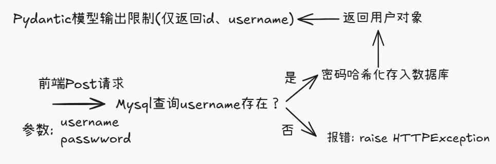

#### 登录流程：

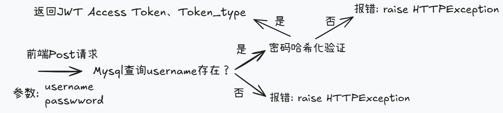

#### 修改密码：

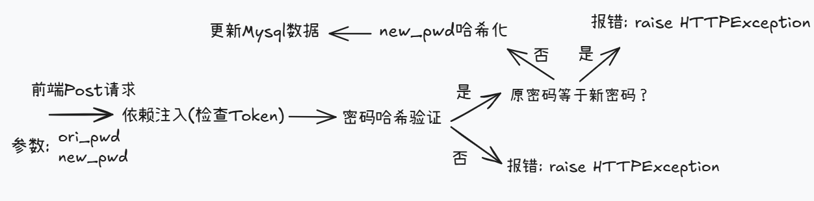

#### 注销流程：

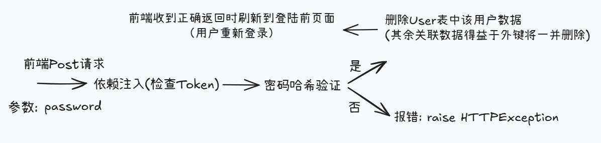

### 2.2 文档管理

文档管理即为简单的增删改查和AI摘要功能，CRUD逻辑较简单，重点关注获取用户全部文档

#### 分页获取用户全部文档：


#### AI摘要：

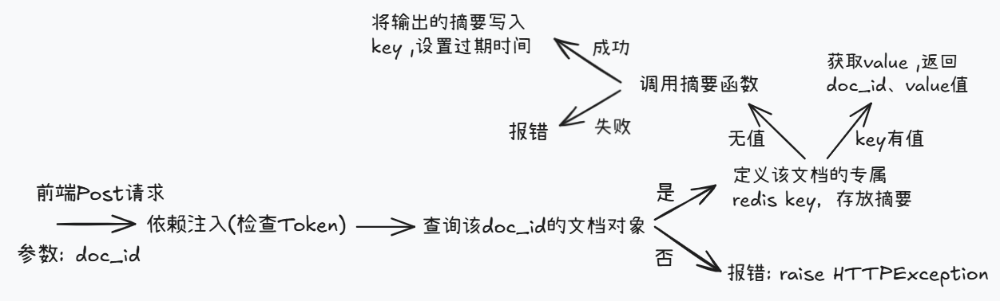

### 2.3 用户上传PDF处理

用户上传PDF作为知识库资料为后续医学问答做基础，增加Redis缓存，提高响应速度

##### 流程：

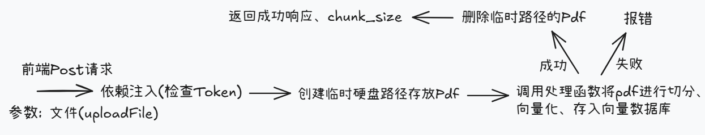

### 2.4 智能问答(RAG+记忆)

加入Redis缓存，同一问题可快速响应，无需调用大模型

##### 流程：

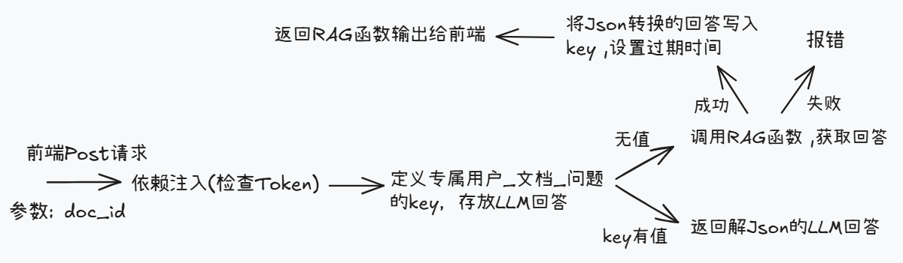

### 2.5 数据模型

models.py — Tortoise ORM 定义的 4 张表：

| 表          | 核心字段                                                     | 用途              |
| ----------- | ------------------------------------------------------------ | ----------------- |
| User        | id, username, password(bcrypt)                               | 用户账户          |
| Document    | id, title, content, created_at, FK→User                      | 用户文档          |
| TokenLog    | id, FK→User, action, prompt_tokens, completion_tokens, total_tokens | AI Token 消耗审计 |
| ChatHistory | id, FK→User, FK→Document, role(human/ai), content, created_at | 多轮对话历史      |

schemas.py定义Pydantic模型 — 接口入参、出参时做数据校验，格式化返回内容，可接收ORM对象并自动转为字典（先转Pydantic对象再转为字典）, 拼接Pydantic模型中的字段名、类型和描述作为提示词给到LLM

项目中各模型的作用如下表：

| 模型             | 方向 | 核心控制                            |
| ---------------- | ---- | ----------------------------------- |
| UserCreate       | 输入 | 用户名 3-11 位，密码 6-13 位        |
| Pwdchange        | 输入 | 原密码和新密码各 ≤13 位             |
| Verifypwd        | 输入 | 注销时密码 ≤13 位                   |
| DocumentCreate   | 输入 | title 必填，content 可选            |
| DocumentUpdate   | 输入 | title 和 content 都可选（部分更新） |
| AskRequest       | 输入 | question 和 doc_id 都必填           |
| UserResponse     | 输出 | 过滤掉 password                     |
| Token            | 输出 | 固定 access_token + token_type      |
| DocumentOut      | 输出 | 文档的完整公开字段                  |
| Page_doc_respond | 输出 | 列表 + 分页信息                     |
| DocumentSummary  | 输出 | 摘要结果(doc_id、summary、source)   |
| Response_Limit   | 内部 | 控制 LLM 输出                       |

### 2.6 基础设施

基础设施包含 main.py、Dockerfile、docker-compose.yml以及一些配置文件例如 .env，.gitignore，requirement.txt，llm_config.py，.dockerignore

#### 2.6.1 main函数

FastAPI 入口 + Tortoise ORM 注册 + Swagger 配置

#### 2.6.2 Dockerfifle

是一份镜像构建脚本，打包项目，过程为：

① 拉取基础 Python 镜像（指定版本）

② 设置工作目录

③ 拷贝依赖文件 `(requirements.txt)` 到工作目录、安装 `requirements.txt` 所有包

④ 拷贝本地所有的代码文件（在.dockerignore声明要忽略的文件）

⑤ 对外暴露端口

⑥ 设置启动命令（运行 FastAPI 服务）

#### 2.6.3 docker-compose.yml（章鱼哥）

**用来批量编排、管理多个 Docker 容器**，靠一份 `docker-compose.yml` 配置文件，一键启停、编排一组关联容器。

**步骤 1：声明版本号（文件第一行）**

Compose 语法有版本区分，选用稳定版 `3.8`，写在文件最顶部。

**步骤 2：定义顶级节点（顶格写） services**

所有容器服务都写在 `services` 下，格式固定：

**步骤 3：编写第一个服务：MySQL（db）**

按「基础镜像 → 容器名 → 重启策略 → 环境变量 → 端口 → 数据挂载 → 健康检查」顺序编写。

**3.1 定义服务名、镜像、容器名**

* 服务名：`db`（后续后端用这个名字连接数据库）

* `image`：指定官方 MySQL 镜像版本

* `container_name`：自定义容器名称，方便运维查看

* `restart: always`：容器意外退出自动重启

**3.2 配置数据库环境变量**

设置密码、默认数据库名，**必须和后端连接配置一致**：

```shell
environment:
  MYSQL_ROOT_PASSWORD: *****
  MYSQL_DATABASE: docpilot
```

**3.3 端口映射**

宿主机端口：容器内部端口，外部工具可通过 `3307` 连接数据库：

```shell
ports:
  - "3307:3306"
```

**3.4 数据卷挂载（数据持久化）**

把容器内数据库目录映射到本地文件夹，删除容器数据不丢失：

```shell
volumes:
  - ./mysql_data:/var/lib/mysql
```

**3.5 配置健康检查**

判断 MySQL 是否真正启动就绪，给后端做启动依赖判断：

```shell
healthcheck:
  test: ["CMD-SHELL", "mysqladmin ping -h localhost -u root -p123456"]
  interval: 5s
  timeout: 5s
  retries: 10
```

**步骤 4：编写第二个服务：FastAPI 后端（web）**

**4.1 基础配置、构建规则**

- `build: .`：使用当前目录 `Dockerfile` 构建镜像
- 自定义容器名、重启策略

```shell
web:
build: .
container_name: docpilot_fastapi
restart: always
```

**4.2 端口映射**

对外暴露 FastAPI 服务端口：

```shell
ports:
  - "8000:8000"
```

**4.3 加载环境文件 + 覆盖连接地址**

1. `env_file`：读取项目 `.env` 文件（存放大模型密钥等）
2. `environment`：**覆盖**数据库连接地址，容器内用服务名 `db` 访问 MySQL

```shell
env_file:
  - .env
environment:
  - DB_URL=mysql://root:123456@db:3306/docpilot
```

**4.4 配置启动依赖**

等待 `db` 服务**健康检查通过**后，再启动后端，避免连库失败：

```shell
depends_on:
  db:
    condition: service_healthy
```

至此两个核心服务全部写完。

#### 2.6.4 requirement.txt

项目依赖清单，记录项目需要安装的**第三方库、版本号**，每行写一个包，格式：`包名==版本号`（固定版本，推荐）

#### 2.6.5 .env

环境变量配置文件，用来统一存放项目的密钥、账号、地址、开关等敏感 / 可变配置，
配合 `python-dotenv` 库读取。

每行一条配置，格式：`变量名=值`，字符串、数字直接写，不需要引号

#### 2.6.6 llm_config.py

配置对话大模型以及向量模型实例，可将API_Key写在.env，通过dotenv导入

#### 2.6.7 .dockerignore/.gitignore

`.gitignore` 作用：**Git 提交代码时，自动忽略指定文件 / 目录**，不上传到远程仓库。

`.dockerignore`作用：Dockerfifle拷贝本地代码文件时，自动忽略指定文件 / 目录，不进行拷贝。

基础语法规则：

1、基础匹配

直接写文件名 / 目录名：匹配当前目录下对应文件 / 目录

```shell
test.txt       # 忽略根目录的 test.txt
temp/          # 忽略根目录 temp 整个文件夹（末尾加 / 代表目录）
```

不加 `/`：**全局匹配**，项目内所有位置的同名文件 / 目录都会被忽略

```shell
__pycache__    # 所有层级下的 __pycache__ 目录全部忽略
*.log          # 所有 .log 日志文件
```

2、通配符

2.1 `*`：匹配**任意多个字符**（不含路径分隔符 `/`）

```shell
*.pyc    # 忽略所有 .pyc 后缀文件
*.tmp    # 忽略所有临时文件
```

2.2 `?`：匹配**单个任意字符**

```shell
test?.txt  # 匹配 test1.txt、testA.txt 等
```

2.3 `**`：跨层级匹配（递归匹配任意子目录）

```shell
**/node_modules  # 项目所有子目录里的 node_modules 都忽略
```

3、路径分隔 & 层级

/xxx：仅匹配项目根目录下的 xxx

```shell
/readme.md  # 只忽略根目录 readme.md，子目录里的 readme.md 不忽略
```

4、取反（!）：强制不忽略

规则：先用规则忽略，再用 `!` 取消忽略（**必须写在忽略规则之后**）

```shell
# 忽略所有 .txt 文件
*.txt
# 唯独保留 note.txt，不忽略
!note.txt
```

## 3. 重要函数实现逻辑

### 3.1 JWT Access Token

在用户登录成功后，返回 create_access_token(data: dict) 函数输出的 JWT 令牌

**create_access_token(data: dict)**函数逻辑：

1、函数接收data字典 — "sub" : str(user.id)

2、拷贝入参字典，**避免修改原始字典**

3、计算出**令牌过期时间** expire

4、追加过期时间到字典中

5、使用 `SECRET_KEY`（密钥）和指定 `ALGORITHM`（加密算法），将完整字典加密，**返回最终 JWT 字符串（Token）**。

### 3.2 依赖注入Depends

作用机理：请求进来 → FastAPI 识别接口上的 `Depends(依赖函数)`

1. 先执行依赖函数
2. 拿到依赖函数的返回值
3. 自动把返回值注入（传递）给接口参数
4. 再执行接口主体逻辑

get_current_user函数逻辑 — 保安大叔：

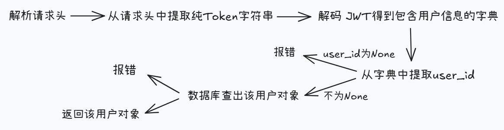

### 3.3 PDF文件处理函数

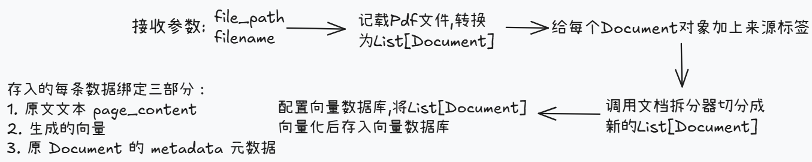

### 3.4 意图识别+RAG-Memory 函数

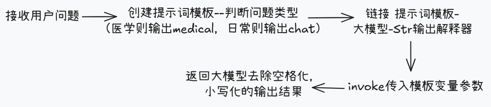

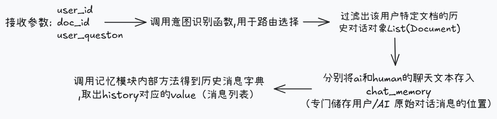

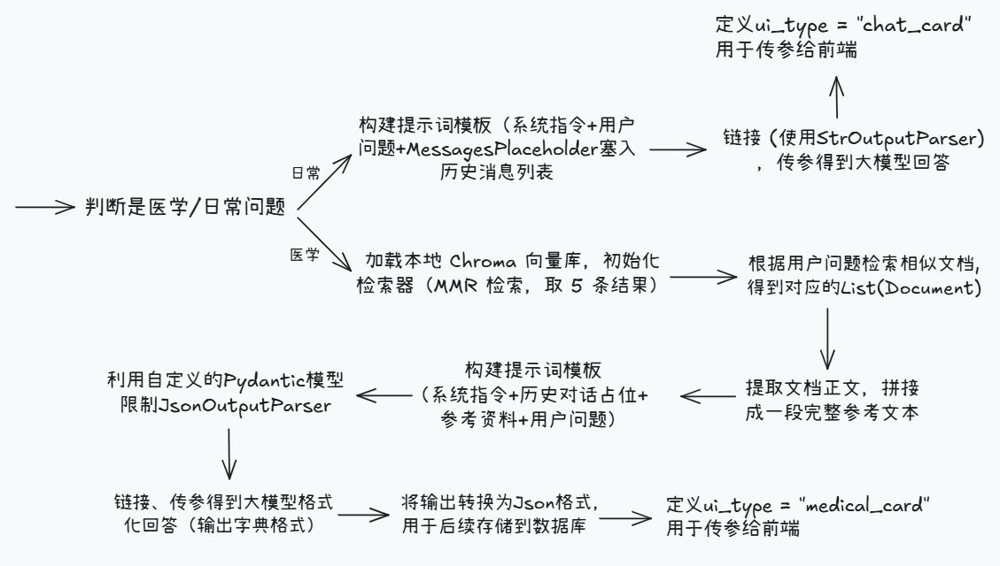

最后将大模型回答存入数据库、返回给前端。
